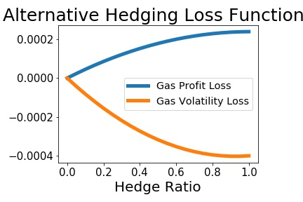

# MGRM's Hedging Revisited

## MGRM's Hedging Background Information

- MG Refining & Marketing - US Subsidiary of German firm Metallgesellschaft
- One of the largest derivatives trading losses in history
- Sparked a large academic debate

## MGRM's Hedging Practices

- In 1991 MGRM began offering long-term fixed price deliveries on refined products (Gasoline & Heating oil)
- By December, 1991 hold sold forward the equivalent of 160 million barrels
- Hedged with a 1-for-1 stack and roll futures hedge (mostly) in the nearby NYMEX contracts
- Relied on a long-term trend of backwardation to systematically earn roll-over profits
- By December, 1993 the market moved to contango
- MGRM began experiencing large paper losses (hedging cash flows were mismatched with contract cash flows)
- Management eventually lifted the hedge, leading to massive losses (approx. $1.4b)

## The Academic Debate

- MGRM's hedging was roundly criticized by academics
- Famously (infamously?) Culp & Miller defended MGRM's hedging practice as essentially sound
- The main criticisms:
    * The 1-for-1 hedge ratio was hugely speculative (relative to a minimum-variance benchmark)
    * The stack-and-roll was dangerous - MGRM should have used a strip hedge by matching contract and hedging cash flows
    * Huge operational risk (geeks vs suits)

## The Academic Debate Continued

Con: 

- Mello & Parsons (1995)
- Edwards & Canter (1995)
- Pirrong's BAG (VECM-MGARCH) hedging ratio analysis (1997)

Pro:

- Culp & Miller (1994, 1995a, 1995b)
- Bollen & Whaley (1998)


# Empirical Results

## The Importance of the Loss Function

- It seems the academic debate has really been a debate about the loss function used to evaluate the performance of MGRM's hedging practices.
    * Most of the academic criticism evaluated MGRM from the perspective of a mimimum-variance (or volatility reduction) loss function that is standard in that literature
    * Culp & Miller point out that MGRM were more in line with Holbrook Working's carrying-charge (or arbitrage) hedging
- This suggests a loss function based more on the profitability of trading than variance reduction. 
    * Cash flows may have been reduced from the no-hedge position, but this is a secondary motivation at most
    
    
## Alternative Loss Functions

- To this end we evaluate the following loss functions:

$$
r_{m,t+1} = \ln{[\Delta S_{t+1} - \gamma_{m}^{\ast} \Delta F_{t+1}]} - \ln{[\Delta S_{t+1} - \gamma_{0} \Delta F_{t+1}]}
$$

and

$$
v_{m,t+1} = [\Delta S_{t+1} - \gamma_{m}^{\ast} \Delta F_{t+1}]^{2} - [\Delta S_{t+1} - \gamma_{0} \Delta F_{t+1}]^{2}
$$

where

* $\gamma_{m}$ is the fixed hedge ratio from 0.0 to 1.0 by 0.05
* $\gamma_{0} = 0.0$ is the no-hedging benchmark

## Loss Functions Continued

We base our findings on the average loss values

$$
\bar{r}_{m} = (n)^{-1} \sum\limits_{t=R}^{T} r_{m,t+1}
$$

and 

$$
\bar{v}_{m} = (n)^{-1} \sum\limits_{t=R}^{T} v_{m,t+1}
$$

for $m = 1, \ldots, 21$ where $\gamma_{m} = 0.0, 0.05, \ldots, 0.95, 1.0$.


## Historical Results




## 


# The Bootstrap Hedging Simulator

## The Bootstrap Snooper

- These simple graphs tell quite a story, but one has to account for data snooping
- We employ the bootstrap to estimate the sampling distribution of the two loss functions
- Specifically we employ the Stationary Bootstrap of Politis & Romano (JASA 1994)

# Bootstrap Results

## Gas Profit Measure

```{r echo=FALSE, results='asis', }
library(knitr)
setwd("/home/brough/USU/Research/Projects/repos/mgrm-present/present/tables")
gas.prf <- read.csv("gas-profit-res.csv", header=T)
names(gas.prf) <- c("Hedge Ratio", "Mean", "Max", "Min", "Std")
kable(gas.prf[1:10,], digits = 4, caption="Summary Statistics: Gas Profit/Loss Function")
```

## Gas Profit Measure Continued

```{r echo=FALSE, results='asis', }
library(knitr)
setwd("/home/brough/USU/Research/Projects/repos/mgrm-present/present/tables")
gas.prf <- read.csv("gas-profit-res.csv", header=T)
names(gas.prf) <- c("Hedge Ratio", "Mean", "Max", "Min", "Std")
kable(gas.prf[11:21,], digits = 4, caption="Summary Statistics: Gas Profit/Loss Function")
```


## Gas Volatility Measure

```{r echo=FALSE, results='asis', }
library(knitr)
setwd("/home/brough/USU/Research/Projects/repos/mgrm-present/present/tables")
gas.prf <- read.csv("gas-volatility-res.csv", header=T)
names(gas.prf) <- c("Hedge Ratio", "Mean", "Max", "Min", "Std")
kable(gas.prf[1:10,], digits = 4, caption="Summary Statistics: Gas Volatility Loss Function")
```

## Gas Volatility Measure Continued

```{r echo=FALSE, results='asis', }
library(knitr)
setwd("/home/brough/USU/Research/Projects/repos/mgrm-present/present/tables")
gas.prf <- read.csv("gas-volatility-res.csv", header=T)
names(gas.prf) <- c("Hedge Ratio", "Mean", "Max", "Min", "Std")
kable(gas.prf[11:21,], digits = 4, caption="Summary Statistics: Gas Volatility Loss Function")
```


## Oil Profit Measure

```{r echo=FALSE, results='asis', }
library(knitr)
setwd("/home/brough/USU/Research/Projects/repos/mgrm-present/present/tables")
oil.prf <- read.csv("oil-profit-res.csv", header=T)
names(oil.prf) <- c("Hedge Ratio", "Mean", "Max", "Min", "Std")
kable(oil.prf[1:10,], digits = 4, caption="Summary Statistics: Oil Profit/Loss Function")
```

## Oil Profit Measure Continued

```{r echo=FALSE, results='asis', }
library(knitr)
setwd("/home/brough/USU/Research/Projects/repos/mgrm-present/present/tables")
oil.prf <- read.csv("oil-profit-res.csv", header=T)
names(oil.prf) <- c("Hedge Ratio", "Mean", "Max", "Min", "Std")
kable(oil.prf[11:21,], digits = 4, caption="Summary Statistics: Oil Profit/Loss Function")
```


## Oil Volatility Measure

```{r echo=FALSE, results='asis', }
library(knitr)
setwd("/home/brough/USU/Research/Projects/repos/mgrm-present/present/tables")
oil.prf <- read.csv("oil-volatility-res.csv", header=T)
names(oil.prf) <- c("Hedge Ratio", "Mean", "Max", "Min", "Std")
kable(oil.prf[1:10,], digits = 4, caption="Summary Statistics: Oil Volatility Loss Function")
```

## Oil Volatility Measure Continued

```{r echo=FALSE, results='asis', }
library(knitr)
setwd("/home/brough/USU/Research/Projects/repos/mgrm-present/present/tables")
oil.prf <- read.csv("oil-volatility-res.csv", header=T)
names(oil.prf) <- c("Hedge Ratio", "Mean", "Max", "Min", "Std")
kable(oil.prf[11:21,], digits = 4, caption="Summary Statistics: Oil Volatility Loss Function")
```


## Gas Profit-Loss Function Histogram


## Gas Volatility-Loss Function Histogram


## Oil Profit-Loss Function Histogram


## Oil Volatility-Loss Function Histogram


## Summary

- We have highlighted the importance of the loss function in evaluating hedging peformance
- This applies especially to the academic debate over MGRM's hedging
- According to the returns-based loss function, MGRM's fixed-ratio 1-for-1 hedge ratio was superior
- Perhaps much of the historical debate amounted to economists speaking past eachother

## Next Steps

- Out bootstrap results are strongly suggestive, but we need to formalize our tests
- Employ the following: White's RC, Hansen's SPA, Romano & Wolf's MCP
- One of Pirrong's strong criticisms was that MGRM did not properly dynamically hedge
    * We will then include his BAG estimator as the benchmark
    * Also include more recent advancements in dynamic heding (such as Alizadeh et al's MRS-BEKK)
    
- Other measures of loss:
    * Total terminal cash flows
    * Keep track of liquidity problems (e.g. percentage of simulations with capital losses below some threshold)
    
- Consider other strategies to augment MGRM's historical hedging practices
    * Synthetic capital policies
    * Option-based delta hedging

