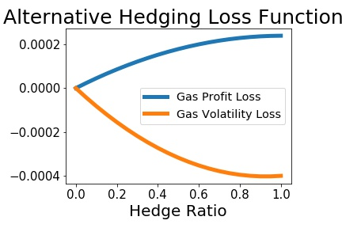
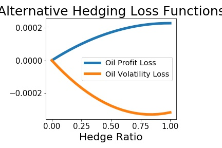

# MGRM's Hedging Revisited

## MGRM's Hedging Practices

- Turn off alarm
- Get out of bed

## The Academic Debate

- Eat eggs
- Drink coffee


----

# Empirical Results

## The Importance of the Loss Function

- It seems the academic debate has really been a debate about the loss function used to evaluate the performance of MGRM's hedging practices.
    * Most of the academic criticism evaluated MGRM from the perspective of a mimimum-variance (or volatility reduction) loss function that is standard in that literature
    * Culp & Miller point out that MGRM were more in line with Holbrook Working's carrying-charge (or arbitrage) hedging
- This suggests a loss function based more on the profitability of trading than variance reduction. 
    * Cash flows may have been reduced from the no-hedge position, but this is a secondary motivation at most
    
    
## Alternative Loss Functions

- To this end we evaluate the following loss functions:

$$
r_{m,t+1} = \ln{[\Delta S_{t+1} - \gamma_{m}^{\ast} \Delta F_{t+1}]} - \ln{[\Delta S_{t+1} - \gamma_{0} \Delta F_{t+1}]}
$$

and

$$
v_{m,t+1} = [\Delta S_{t+1} - \gamma_{m}^{\ast} \Delta F_{t+1}]^{2} - [\Delta S_{t+1} - \gamma_{0} \Delta F_{t+1}]^{2}
$$

where

* $\gamma_{m}$ is the fixed hedge ratio from 0.0 to 1.0 by 0.05
* $\gamma_{0} = 0.0$ is the no-hedging benchmark

## Loss Functions Continued

We base our findings on the average loss values

$$
\bar{r}_{m} = (n)^{-1} \sum\limits_{t=R}^{T} r_{m,t+1}
$$

and 

$$
\bar{v}_{m} = (n)^{-1} \sum\limits_{t=R}^{T} v_{m,t+1}
$$

for $m = 1, \ldots, 21$ where $\gamma_{m} = 0.0, 0.05, \ldots, 0.95, 1.0$.


## Historical Results




## 




# The Bootstrap Hedging Simulator

## The Bootstrap Snooper

- These simple graphs tell quite a story, but one has to account for data snooping
- We employ the bootstrap to estimate the sampling distribution of the two loss functions
- Specifically we employ the Stationary Bootstrap of Politis & Romano (JASA 1994)

# Bootstrap Results

## Bob

```{r kable}
n <- 100
x <- rnorm(n)
y <- 2*x + rnorm(n)
out <- lm(y ~ x)
library(knitr)
kable(summary(out)$coef, digits=2)
```


## Summary

## Next Steps

- Out bootstrap results are strongly suggestive, but we need to formalize our tests
- Employ the following: White's RC, Hansen's SPA, Romano & Wolf's MCP
- One of Pirrong's strong criticisms was that MGRM did not properly dynamically hedge
    * We will then include his BAG estimator as the benchmark
    * Also include more recent advancements in dynamic heding (such as Alizadeh et al's MRS-BEKK)
    
- Other measures of loss:
    * Total terminal cash flows
    * Keep track of liquidity problems (e.g. percentage of simulations with capital losses below some threshold)
    
- Consider other strategies to augment MGRM's historical hedging practices
    * Synthetic capital policies
    * Option-based delta hedging

